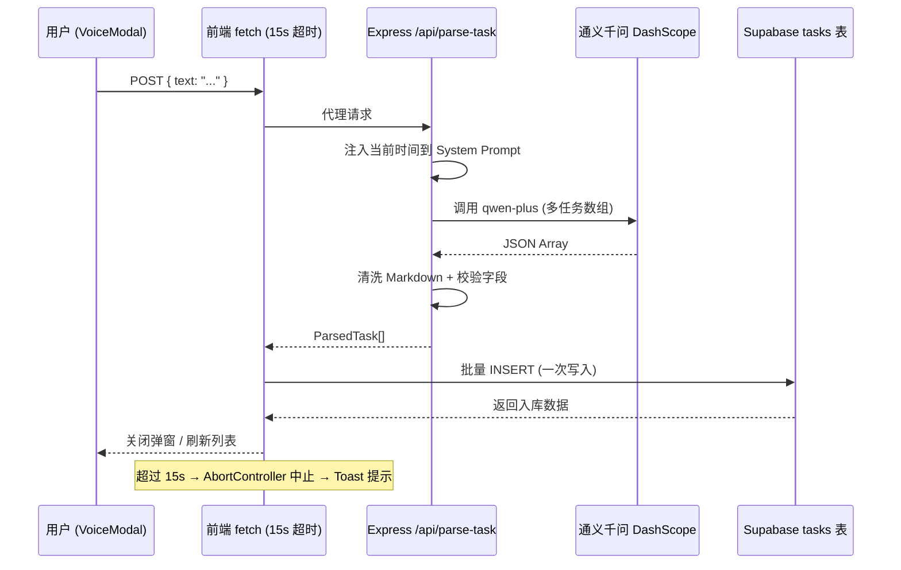

# Walkthrough: To-Do 应用 — 商业级 AI 语音分拣重构

## Phase 2 变更总览

---

## 修改的文件

| 文件 | 核心变更 |
|------|---------|
| [supabase_migration_v2.sql](file:///d:/HuaweiMoveData/Users/RAY0826/Desktop/manager/supabase_migration_v2.sql) | `ALTER TABLE tasks ADD due_date` |
| [server.ts](file:///d:/HuaweiMoveData/Users/RAY0826/Desktop/manager/server.ts) | 时间注入 + 多任务数组 + Markdown 清洗 |
| [src/App.tsx](file:///d:/HuaweiMoveData/Users/RAY0826/Desktop/manager/src/App.tsx) | [ParsedTask](file:///d:/HuaweiMoveData/Users/RAY0826/Desktop/manager/src/App.tsx#36-43) 类型 / [addTasks](file:///d:/HuaweiMoveData/Users/RAY0826/Desktop/manager/src/App.tsx#183-209) 批量插入 / 15s 超时 / Toast |

---

## 关键改进

### 1. 后端：时间上下文注入
[buildSystemPrompt()](file:///d:/HuaweiMoveData/Users/RAY0826/Desktop/manager/server.ts#18-39) 在每次请求时获取系统时间并注入 Prompt，使 AI 能将"明天下午"转换为精确的 ISO 时间戳。

### 2. 后端：多任务拆解
System Prompt 要求 AI 返回 **JSON 数组**，一次语音输入可拆解出多个独立任务。兼容单对象返回（自动包装为数组）。

### 3. 前端：批量写入
[addTasks()](file:///d:/HuaweiMoveData/Users/RAY0826/Desktop/manager/src/App.tsx#183-209) 使用 Supabase `.insert(rows)` 一次性写入整个任务数组，避免循环单插入。

### 4. 前端：15 秒超时 + Toast
[fetchWithTimeout()](file:///d:/HuaweiMoveData/Users/RAY0826/Desktop/manager/src/App.tsx#716-734) 使用 `AbortController` 实现硬超时，超时后自动停止 loading 动画并弹出 Toast 错误提示（4 秒自动消失）。

---

## 验证结果

- ✅ Vite 构建成功：`✓ built in 9.73s`

### 用户操作
1. 在 Supabase SQL Editor 中执行 [supabase_migration_v2.sql](file:///d:/HuaweiMoveData/Users/RAY0826/Desktop/manager/supabase_migration_v2.sql)
2. 重启 `npm run dev`（后端 server.ts 已变更，需重启）
